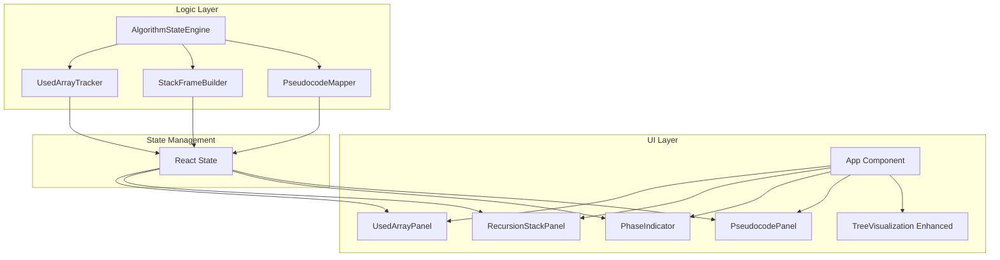

# Design Document

## Overview

算法解释增强系统旨在为全排列可视化工具添加更深入的算法概念展示功能。参考 LeetCode 题解的讲解方式，通过 Used 数组可视化、递归调用栈展示、"选择-探索-撤销"模式高亮、伪代码同步等功能，帮助用户深入理解回溯算法的执行原理。

核心功能包括：
- Used 数组状态可视化
- 递归调用栈实时展示
- 回溯三阶段模式高亮
- 伪代码同步高亮
- 剪枝原因提示

## Architecture



## Components and Interfaces

### Used Array Tracker

```typescript
// Used 数组状态
interface UsedArrayState {
  numbers: number[];           // 原始输入数组
  used: boolean[];             // 每个数字的使用状态
  lastChangedIndex: number | null;  // 最近变化的索引（用于动画）
  changeType: 'select' | 'backtrack' | null;  // 变化类型
}

// Used 数组追踪器
interface IUsedArrayTracker {
  getUsedArray(inputNumbers: number[], currentPath: number[]): UsedArrayState;
  getChangedIndex(prevPath: number[], currentPath: number[], inputNumbers: number[]): number | null;
}
```

### Recursion Stack

```typescript
// 栈帧结构
interface StackFrame {
  depth: number;              // 递归深度（从0开始）
  path: number[];             // 当前路径
  available: number[];        // 可选数字
  currentChoice: number | null;  // 当前选择的数字
}

// 递归栈状态
interface RecursionStackState {
  frames: StackFrame[];
  maxDepth: number;
}

// 栈帧构建器
interface IStackFrameBuilder {
  buildStack(currentPath: number[], available: number[], inputNumbers: number[]): RecursionStackState;
}
```

### Phase Indicator

```typescript
// 回溯阶段
type BacktrackPhase = 'choose' | 'explore' | 'unchoose' | 'complete' | 'idle';

// 阶段指示器状态
interface PhaseIndicatorState {
  phase: BacktrackPhase;
  targetNumber: number | null;  // 选择或撤销的数字
  description: string;          // 阶段描述
}

// 阶段颜色映射
const PHASE_COLORS: Record<BacktrackPhase, string> = {
  choose: '#4CAF50',    // 绿色 - 选择
  explore: '#2196F3',   // 蓝色 - 探索
  unchoose: '#FF9800',  // 橙色 - 撤销
  complete: '#9C27B0',  // 紫色 - 完成
  idle: '#9E9E9E'       // 灰色 - 空闲
};
```

### Pseudocode Mapper

```typescript
// 伪代码行
interface PseudocodeLine {
  lineNumber: number;
  code: string;
  indent: number;
  type: 'function' | 'condition' | 'action' | 'recursion' | 'return';
}

// 伪代码状态
interface PseudocodeState {
  lines: PseudocodeLine[];
  highlightedLine: number | null;
  highlightType: 'select' | 'backtrack' | 'complete' | 'recursion' | null;
}

// 伪代码映射器
interface IPseudocodeMapper {
  getHighlightedLine(stepType: StepType): number;
  getPseudocode(): PseudocodeLine[];
}

// 回溯算法伪代码
const BACKTRACK_PSEUDOCODE: PseudocodeLine[] = [
  { lineNumber: 1, code: 'function backtrack(path, used):', indent: 0, type: 'function' },
  { lineNumber: 2, code: '  if path.length == n:', indent: 1, type: 'condition' },
  { lineNumber: 3, code: '    result.add(path.copy())  // 添加结果', indent: 2, type: 'action' },
  { lineNumber: 4, code: '    return', indent: 2, type: 'return' },
  { lineNumber: 5, code: '  for i in range(n):', indent: 1, type: 'condition' },
  { lineNumber: 6, code: '    if used[i]: continue  // 剪枝', indent: 2, type: 'condition' },
  { lineNumber: 7, code: '    path.append(nums[i])  // 选择', indent: 2, type: 'action' },
  { lineNumber: 8, code: '    used[i] = true', indent: 2, type: 'action' },
  { lineNumber: 9, code: '    backtrack(path, used)  // 递归', indent: 2, type: 'recursion' },
  { lineNumber: 10, code: '    path.pop()  // 撤销选择', indent: 2, type: 'action' },
  { lineNumber: 11, code: '    used[i] = false', indent: 2, type: 'action' },
];
```

### React Components Props

```typescript
// Used 数组面板 Props
interface UsedArrayPanelProps {
  state: UsedArrayState;
}

// 递归栈面板 Props
interface RecursionStackPanelProps {
  state: RecursionStackState;
  currentDepth: number;
}

// 阶段指示器 Props
interface PhaseIndicatorProps {
  state: PhaseIndicatorState;
}

// 伪代码面板 Props
interface PseudocodePanelProps {
  state: PseudocodeState;
}
```

## Data Models

### Extended Animation Step

```typescript
// 扩展的动画步骤（包含算法解释信息）
interface ExtendedAnimationStep extends AnimationStep {
  usedArray: boolean[];
  stackDepth: number;
  phase: BacktrackPhase;
  highlightedPseudocodeLine: number;
}
```

### Algorithm Explanation State

```typescript
interface AlgorithmExplanationState {
  // Used 数组
  usedArrayState: UsedArrayState;
  
  // 递归栈
  recursionStackState: RecursionStackState;
  
  // 阶段指示
  phaseState: PhaseIndicatorState;
  
  // 伪代码
  pseudocodeState: PseudocodeState;
}
```

## Correctness Properties

*A property is a characteristic or behavior that should hold true across all valid executions of a system-essentially, a formal statement about what the system should do. Properties serve as the bridge between human-readable specifications and machine-verifiable correctness guarantees.*

### Property 1: Used Array Consistency
*For any* animation step with a current path, the used array SHALL have `true` for exactly those numbers that appear in the current path, and `false` for all other numbers.
**Validates: Requirements 1.1, 1.2, 1.3**

### Property 2: Stack Depth Equals Path Length
*For any* animation step, the recursion stack depth SHALL equal the length of the current path.
**Validates: Requirements 2.1, 2.2, 2.3**

### Property 3: Stack Frame Path Consistency
*For any* stack frame at depth d, the path stored in that frame SHALL be a prefix of length d of the current path.
**Validates: Requirements 2.4**

### Property 4: Phase Indicator Correctness
*For any* select step, the phase indicator SHALL show "choose" with the last number in the current path. *For any* backtrack step, the phase indicator SHALL show "unchoose" with the number that was removed.
**Validates: Requirements 3.1, 3.3**

### Property 5: Pseudocode Line Mapping
*For any* step type, the highlighted pseudocode line SHALL correspond to the correct action: select → line 7/8, backtrack → line 10/11, complete → line 3.
**Validates: Requirements 4.2, 4.3, 4.4, 4.5**

## Error Handling

### State Inconsistency

| Error Condition | Handling |
|----------------|----------|
| Used array length mismatch | Reset to match input numbers length |
| Stack depth exceeds input size | Cap at input size |
| Invalid phase for step type | Default to 'idle' phase |
| Pseudocode line out of range | Highlight no line |

### Edge Cases

- 空输入数组：显示空的 used 数组和栈
- 单元素数组：栈深度最大为 1
- 动画重置：清空所有状态到初始值

## Testing Strategy

### Unit Testing

使用 Vitest 进行单元测试：

- `UsedArrayTracker.getUsedArray` 的状态计算
- `StackFrameBuilder.buildStack` 的栈构建
- `PseudocodeMapper.getHighlightedLine` 的行映射
- React 组件的渲染和状态显示

### Property-Based Testing

使用 fast-check 进行属性测试：

- 配置每个属性测试运行至少 100 次迭代
- 每个属性测试必须标注对应的正确性属性
- 格式：`**Feature: algorithm-explanation-enhancement, Property {number}: {property_text}**`

测试重点：
1. Used 数组与当前路径的一致性
2. 递归栈深度与路径长度的对应关系
3. 阶段指示器与步骤类型的匹配
4. 伪代码高亮行与步骤类型的映射
