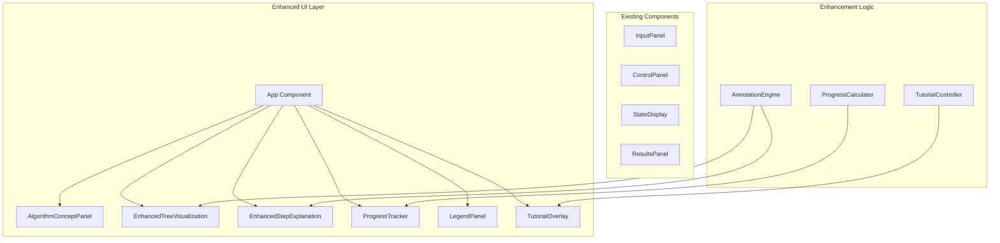

# Design Document

## Overview

动画增强系统是对现有全排列算法可视化工具的升级，旨在通过丰富的视觉指示、详细的步骤解释和交互式教学功能，让用户能够直观理解回溯算法的工作原理。

核心增强功能包括：
- 算法伪代码面板，实时高亮当前执行行
- 树节点上的动态标注和动画箭头
- 详细的步骤解释，说明每个操作的原因
- 树与状态显示之间的视觉关联
- 进度追踪和迷你地图
- 交互式教程模式
- 完整的图例说明

## Architecture



## Components and Interfaces

### Algorithm Concept Panel

```typescript
// 伪代码行结构
interface PseudocodeLine {
  id: number;
  code: string;
  explanation: string;
  indent: number;
}

// 伪代码高亮映射
interface CodeHighlightMapping {
  stepType: StepType;
  lineIds: number[];
}

interface AlgorithmConceptPanelProps {
  currentStepType: StepType | null;
  isExpanded: boolean;
  onToggle: () => void;
}
```

### Enhanced Tree Visualization

```typescript
// 节点标注类型
type NodeAnnotationType = 'visiting' | 'selected' | 'backtracking' | 'complete' | null;

// 动画箭头配置
interface AnimatedArrow {
  id: string;
  fromPosition: { x: number; y: number };
  toPosition: { x: number; y: number };
  label: string;
  type: 'select' | 'backtrack';
  duration: number;
}

interface EnhancedTreeVisualizationProps {
  tree: TreeNode | null;
  currentNodeId: string | null;
  visitedNodes: Set<string>;
  completedNodes: Set<string>;
  highlightPath: string[] | null;
  // 新增属性
  showAnnotations: boolean;
  currentAnnotation: NodeAnnotationType;
  animatedArrows: AnimatedArrow[];
  dimUnexplored: boolean;
  connectionToState: boolean;
}
```

### Enhanced Step Explanation

```typescript
interface StepContext {
  stepType: StepType;
  currentPath: number[];
  available: number[];
  selectedNumber: number | null;
  alternatives: number[];
  reason: string;
  nextAction: string;
}

interface EnhancedStepExplanationProps {
  context: StepContext | null;
  isPaused: boolean;
  showAlternatives: boolean;
}
```

### Progress Tracker

```typescript
interface ProgressInfo {
  totalNodes: number;
  visitedCount: number;
  completedCount: number;
  expectedPermutations: number;
  foundPermutations: number;
  currentDepth: number;
  maxDepth: number;
}

interface MiniMapNode {
  id: string;
  x: number;
  y: number;
  state: 'visited' | 'current' | 'unvisited';
}

interface ProgressTrackerProps {
  progress: ProgressInfo;
  miniMapNodes: MiniMapNode[];
  currentNodeId: string | null;
}
```

### Tutorial Controller

```typescript
type TutorialStep = 
  | 'intro'
  | 'first-select'
  | 'continue-select'
  | 'first-complete'
  | 'first-backtrack'
  | 'explore-branch'
  | 'summary';

interface TutorialState {
  isActive: boolean;
  currentStep: TutorialStep;
  userPrediction: string | null;
  isWaitingForPrediction: boolean;
}

interface TutorialControllerProps {
  tutorialState: TutorialState;
  onStartTutorial: () => void;
  onExitTutorial: () => void;
  onPrediction: (prediction: string) => void;
  onContinue: () => void;
}
```

### Legend Panel

```typescript
interface LegendItem {
  id: string;
  type: 'color' | 'icon' | 'arrow';
  visual: string; // CSS color or icon name
  label: string;
  description: string;
}

interface LegendPanelProps {
  items: LegendItem[];
  isExpanded: boolean;
  onToggle: () => void;
  onItemHover: (itemId: string | null) => void;
}
```

## Data Models

### Enhanced Application State

```typescript
interface EnhancedAppState extends AppState {
  // 算法面板状态
  algorithmPanelExpanded: boolean;
  currentCodeLines: number[];
  
  // 增强可视化状态
  showAnnotations: boolean;
  currentAnnotation: NodeAnnotationType;
  animatedArrows: AnimatedArrow[];
  dimUnexplored: boolean;
  
  // 进度追踪
  progressInfo: ProgressInfo;
  miniMapNodes: MiniMapNode[];
  
  // 教程模式
  tutorialState: TutorialState;
  
  // 图例
  legendExpanded: boolean;
  highlightedLegendItem: string | null;
}
```

### Pseudocode Definition

```typescript
const PERMUTATION_PSEUDOCODE: PseudocodeLine[] = [
  { id: 1, code: 'function permute(nums):', explanation: '定义排列函数，接收数字数组', indent: 0 },
  { id: 2, code: '  result = []', explanation: '初始化结果数组，用于存储所有排列', indent: 1 },
  { id: 3, code: '  backtrack([], nums)', explanation: '开始回溯，初始路径为空', indent: 1 },
  { id: 4, code: '  return result', explanation: '返回所有找到的排列', indent: 1 },
  { id: 5, code: '', explanation: '', indent: 0 },
  { id: 6, code: 'function backtrack(path, remaining):', explanation: '回溯函数：path是当前路径，remaining是剩余可选数字', indent: 0 },
  { id: 7, code: '  if remaining is empty:', explanation: '检查是否所有数字都已使用', indent: 1 },
  { id: 8, code: '    result.add(path)', explanation: '找到一个完整排列，添加到结果中', indent: 2 },
  { id: 9, code: '    return', explanation: '返回上一层继续探索', indent: 2 },
  { id: 10, code: '  for num in remaining:', explanation: '遍历所有剩余可选的数字', indent: 1 },
  { id: 11, code: '    path.add(num)', explanation: '选择当前数字，加入路径', indent: 2 },
  { id: 12, code: '    backtrack(path, remaining - num)', explanation: '递归探索，剩余数字减少', indent: 2 },
  { id: 13, code: '    path.remove(num)', explanation: '回溯：撤销选择，恢复状态', indent: 2 },
];

const CODE_HIGHLIGHT_MAPPING: Record<StepType, number[]> = {
  'select': [10, 11, 12],
  'backtrack': [13],
  'complete': [7, 8, 9],
};
```

### Step Explanation Templates

```typescript
const STEP_EXPLANATIONS = {
  select: {
    title: '📥 选择数字',
    template: (num: number, position: number, alternatives: number[]) => ({
      main: `选择数字 ${num} 放在第 ${position} 个位置`,
      reason: `当前可选数字有 [${alternatives.join(', ')}]，按顺序尝试第一个未使用的数字`,
      next: alternatives.length > 1 
        ? `如果这条路径走不通，会回来尝试 ${alternatives.slice(1).join(', ')}`
        : '这是最后一个可选数字',
    }),
  },
  backtrack: {
    title: '↩️ 回溯',
    template: (removedNum: number, returnTo: number[]) => ({
      main: `撤销选择，将 ${removedNum} 放回可选列表`,
      reason: '当前分支已经探索完毕（找到了排列或无路可走）',
      next: returnTo.length > 0 
        ? `返回上一层，尝试其他选择`
        : '所有分支都已探索完毕',
    }),
  },
  complete: {
    title: '✅ 找到排列',
    template: (permutation: number[]) => ({
      main: `成功找到一个排列：[${permutation.join(', ')}]`,
      reason: '所有数字都已使用，当前路径就是一个完整的排列',
      next: '记录这个结果，然后回溯寻找其他排列',
    }),
  },
};
```


## Correctness Properties

*A property is a characteristic or behavior that should hold true across all valid executions of a system-essentially, a formal statement about what the system should do. Properties serve as the bridge between human-readable specifications and machine-verifiable correctness guarantees.*

### Property 1: Code Highlight Mapping Correctness
*For any* step type (select, backtrack, complete), the code highlight mapping SHALL return a non-empty array of line IDs that correspond to the relevant pseudocode lines for that operation.
**Validates: Requirements 1.3**

### Property 2: Arrow Generation Correctness
*For any* animation step of type 'select' or 'backtrack', the arrow generation function SHALL produce an arrow with:
- Correct direction (available→path for select, path→available for backtrack)
- Appropriate label ("选择" for select, "撤销" for backtrack)
- Valid position coordinates
**Validates: Requirements 2.2, 2.3**

### Property 3: Unexplored Branch Dimming
*For any* tree state with a current node, all nodes that are not ancestors of the current node and have not been visited SHALL be marked for dimming.
**Validates: Requirements 2.5**

### Property 4: Step Explanation Completeness
*For any* step context, the generated explanation SHALL contain:
- For 'select': the selected number, its position, and available alternatives
- For 'backtrack': the removed number and the reason for backtracking
- For 'complete': the complete permutation array
**Validates: Requirements 3.2, 3.3, 3.4**

### Property 5: Path Highlighting Correctness
*For any* current node in the tree, the highlight path SHALL contain exactly all node IDs from the root to the current node, in order from root to current.
**Validates: Requirements 4.2**

### Property 6: Progress Calculation Correctness
*For any* animation state, the progress percentage SHALL equal (visitedNodes.size / totalNodes) * 100, and the found permutations count SHALL equal the length of the results array.
**Validates: Requirements 5.1, 5.2**

### Property 7: Mini-map Position Correctness
*For any* tree and current node ID, the mini-map SHALL correctly mark the current node as 'current', visited nodes as 'visited', and all other nodes as 'unvisited'.
**Validates: Requirements 5.4**

### Property 8: Legend Completeness for Node States
*For any* node visual state defined in the system (unvisited, visiting, visited, backtracked, complete), there SHALL exist a corresponding legend item with a matching color and description.
**Validates: Requirements 7.1**

## Error Handling

### UI State Errors

| Error Condition | Handling Strategy |
|----------------|-------------------|
| Missing tree data | Display placeholder message "请先输入数字并开始演示" |
| Invalid step index | Clamp to valid range [0, steps.length - 1] |
| Animation timing conflict | Cancel previous animation before starting new one |
| Tooltip positioning overflow | Adjust position to stay within viewport |

### Tutorial Mode Errors

| Error Condition | Handling Strategy |
|----------------|-------------------|
| Tutorial started without data | Prompt user to input numbers first |
| User skips prediction | Allow skip with "跳过" button, continue to next step |
| Tutorial interrupted by reset | Exit tutorial mode gracefully, show confirmation |

### Rendering Errors

| Error Condition | Handling Strategy |
|----------------|-------------------|
| D3 arrow animation failure | Fall back to static arrow display |
| Mini-map overflow | Scale down mini-map to fit container |
| Connection line calculation error | Hide connection line, log error |

## Testing Strategy

### Unit Testing

使用 Vitest 进行单元测试：

- `getCodeHighlightLines(stepType)` 函数的映射正确性
- `generateArrow(step)` 函数的箭头生成
- `generateStepExplanation(context)` 函数的解释生成
- `calculateProgress(state)` 函数的进度计算
- `getHighlightPath(tree, nodeId)` 函数的路径计算
- `generateMiniMap(tree, currentNodeId, visitedNodes)` 函数的迷你地图生成
- React 组件的渲染和交互

### Property-Based Testing

使用 fast-check 进行属性测试：

- 配置每个属性测试运行至少 100 次迭代
- 每个属性测试必须标注对应的正确性属性
- 格式：`**Feature: animation-enhancement, Property {number}: {property_text}**`

测试重点：
1. 代码高亮映射的完整性
2. 箭头生成的正确性
3. 步骤解释的完整性
4. 进度计算的准确性
5. 路径高亮的正确性
6. 迷你地图状态的一致性
7. 图例的完整性

### Integration Testing

- 算法面板与动画状态的同步测试
- 步骤解释与当前状态的一致性测试
- 进度追踪器与实际进度的同步测试
- 教程模式的完整流程测试

