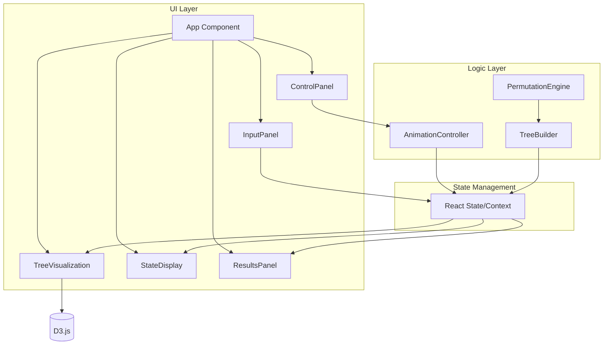

# Design Document

## Overview

全排列算法可视化演示是一个基于 TypeScript、React 和 D3.js 的交互式 Web 应用。它通过动画方式展示回溯算法如何生成数组的所有排列组合，帮助用户理解算法的执行过程。

核心功能包括：
- 回溯树的动态可视化渲染
- 算法状态的实时追踪显示
- 完整的动画播放控制
- 结果集的展示与交互

## Architecture



## Components and Interfaces

### Core Algorithm Engine

```typescript
// 算法步骤类型
type StepType = 'select' | 'backtrack' | 'complete';

// 单个动画步骤
interface AnimationStep {
  type: StepType;
  nodeId: string;
  currentPath: number[];
  available: number[];
  result?: number[];  // 当 type 为 'complete' 时存在
}

// 树节点结构
interface TreeNode {
  id: string;
  value: number | null;  // null 表示根节点
  children: TreeNode[];
  depth: number;
  path: number[];  // 从根到当前节点的路径
}

// 全排列引擎接口
interface IPermutationEngine {
  generateSteps(nums: number[]): AnimationStep[];
  buildTree(nums: number[]): TreeNode;
}
```

### Animation Controller

```typescript
type AnimationState = 'idle' | 'playing' | 'paused' | 'completed';

interface IAnimationController {
  state: AnimationState;
  currentStepIndex: number;
  speed: number;  // 毫秒
  
  play(): void;
  pause(): void;
  stepForward(): void;
  reset(): void;
  setSpeed(ms: number): void;
}
```

### Input Validation

```typescript
interface ValidationResult {
  isValid: boolean;
  error?: string;
  parsedNumbers?: number[];
}

function validateInput(input: string): ValidationResult;
```

### React Components

```typescript
// 输入面板 Props
interface InputPanelProps {
  onSubmit: (nums: number[]) => void;
  disabled: boolean;
}

// 控制面板 Props
interface ControlPanelProps {
  animationState: AnimationState;
  speed: number;
  onPlay: () => void;
  onPause: () => void;
  onStepForward: () => void;
  onReset: () => void;
  onSpeedChange: (speed: number) => void;
}

// 树可视化 Props
interface TreeVisualizationProps {
  tree: TreeNode | null;
  currentNodeId: string | null;
  visitedNodes: Set<string>;
  highlightPath: string[] | null;
}

// 状态显示 Props
interface StateDisplayProps {
  currentPath: number[];
  available: number[];
}

// 结果面板 Props
interface ResultsPanelProps {
  results: number[][];
  onHover: (result: number[] | null) => void;
}
```

## Data Models

### Application State

```typescript
interface AppState {
  // 输入相关
  inputNumbers: number[];
  
  // 树结构
  tree: TreeNode | null;
  
  // 动画相关
  steps: AnimationStep[];
  currentStepIndex: number;
  animationState: AnimationState;
  speed: number;
  
  // 可视化状态
  currentNodeId: string | null;
  visitedNodes: Set<string>;
  currentPath: number[];
  available: number[];
  
  // 结果
  results: number[][];
  highlightPath: string[] | null;
}
```

### Node Visual States

```typescript
type NodeVisualState = 'unvisited' | 'visiting' | 'visited' | 'backtracked' | 'complete';

const NODE_COLORS: Record<NodeVisualState, string> = {
  unvisited: '#e0e0e0',
  visiting: '#4CAF50',
  visited: '#2196F3',
  backtracked: '#FF9800',
  complete: '#9C27B0'
};
```

## Correctness Properties

*A property is a characteristic or behavior that should hold true across all valid executions of a system-essentially, a formal statement about what the system should do. Properties serve as the bridge between human-readable specifications and machine-verifiable correctness guarantees.*

### Property 1: Valid Input Acceptance
*For any* array of 1 to 6 unique integers within range [-10, 10], the validation function SHALL return `isValid: true` and correctly parse the numbers.
**Validates: Requirements 1.1**

### Property 2: Invalid Input Rejection
*For any* input that contains duplicates, is empty, or has more than 6 numbers, the validation function SHALL return `isValid: false` with an appropriate error message.
**Validates: Requirements 1.2**

### Property 3: Permutation Completeness
*For any* valid input array of size n, the algorithm SHALL generate exactly n! unique permutations, and each permutation SHALL contain exactly the same elements as the input array.
**Validates: Requirements 5.1, 5.2**

### Property 4: Tree Structure Correctness
*For any* valid input array, the generated tree SHALL have a root node with children equal to the input size, and each path from root to leaf SHALL represent a valid permutation.
**Validates: Requirements 2.1**

### Property 5: Algorithm State Consistency
*For any* animation step, the union of `currentPath` and `available` arrays SHALL equal the original input array, with no duplicates.
**Validates: Requirements 3.1, 3.2**

### Property 6: Step Transition Correctness
*For any* 'select' step, exactly one number SHALL move from `available` to `currentPath`. *For any* 'backtrack' step, exactly one number SHALL move from `currentPath` back to `available`.
**Validates: Requirements 3.3, 3.4**

### Property 7: Node Visual State Consistency
*For any* node in the tree, its visual state SHALL be one of: 'unvisited', 'visiting', 'visited', 'backtracked', or 'complete', and each state SHALL have a distinct color.
**Validates: Requirements 2.2, 2.3, 2.4, 6.3**

### Property 8: Step Forward Determinism
*For any* animation state with `currentStepIndex < steps.length - 1`, calling `stepForward()` SHALL increment `currentStepIndex` by exactly 1 and update the visualization state accordingly.
**Validates: Requirements 4.3**

### Property 9: Reset State Restoration
*For any* animation state, calling `reset()` SHALL restore `currentStepIndex` to 0, `animationState` to 'idle', clear `visitedNodes`, and reset `currentPath` and `available` to initial values.
**Validates: Requirements 4.4**

## Error Handling

### Input Validation Errors

| Error Condition | Error Message |
|----------------|---------------|
| Empty input | "请输入至少一个数字" |
| More than 6 numbers | "最多支持6个数字" |
| Duplicate numbers | "数字不能重复" |
| Invalid number format | "请输入有效的整数" |
| Number out of range | "数字必须在-10到10之间" |

### Runtime Error Handling

- D3.js 渲染错误：显示降级的静态树视图
- 动画定时器错误：自动暂停并提示用户
- 状态不一致：自动重置到初始状态

## Testing Strategy

### Unit Testing

使用 Vitest 进行单元测试：

- `validateInput` 函数的各种输入场景
- `PermutationEngine.generateSteps` 的步骤生成
- `TreeBuilder.buildTree` 的树结构构建
- React 组件的渲染和交互

### Property-Based Testing

使用 fast-check 进行属性测试：

- 配置每个属性测试运行至少 100 次迭代
- 每个属性测试必须标注对应的正确性属性
- 格式：`**Feature: permutation-visualizer, Property {number}: {property_text}**`

测试重点：
1. 输入验证的边界条件
2. 排列生成的完整性和正确性
3. 状态转换的一致性
4. 动画步骤的确定性

### Integration Testing

- 完整的用户交互流程测试
- D3.js 渲染与 React 状态同步测试
- 动画控制器与可视化组件的集成测试
