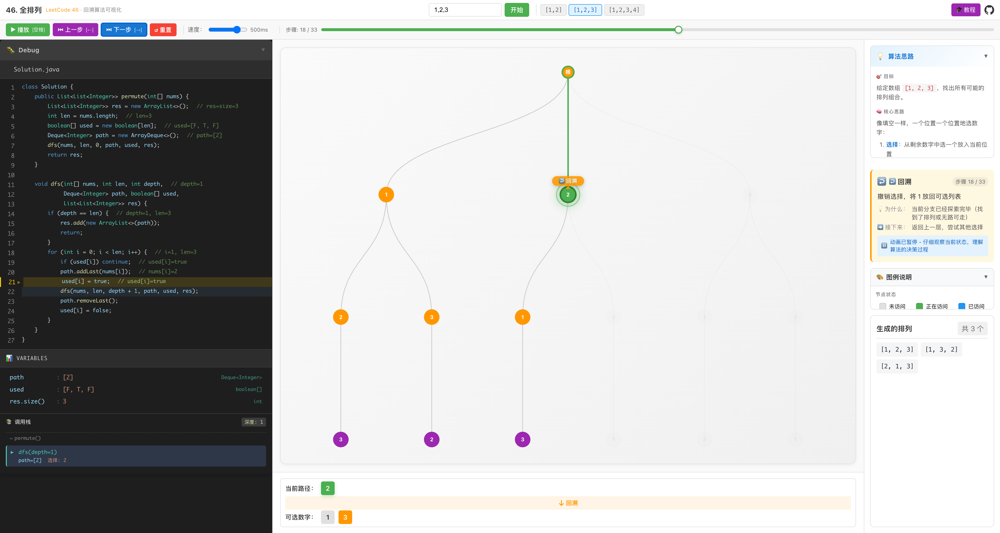

# LeetCode 46. 全排列 - 回溯算法可视化

一个交互式的回溯算法可视化工具，帮助你理解 [LeetCode 46. 全排列](https://leetcode.cn/problems/permutations/) 的解题思路。



## ✨ 特性

- 🌳 **决策树可视化** - 直观展示回溯算法的搜索过程
- 🐛 **代码调试器** - 实时显示 Java 代码执行位置和变量状态
- 📊 **调用栈追踪** - 展示递归调用的层级关系
- ⏯️ **动画控制** - 支持播放、暂停、单步执行、进度拖拽
- 💡 **算法解释** - 每一步都有详细的中文说明
- ⌨️ **快捷键支持** - 空格播放/暂停，方向键单步控制

## 🚀 快速开始

```bash
# 安装依赖
npm install

# 启动开发服务器
npm run dev
```

## 🎮 使用方法

1. 在输入框中输入 1-6 个不重复的数字（如 `1,2,3`）
2. 点击"开始"生成决策树
3. 使用控制按钮或快捷键观察算法执行过程
4. 拖动进度条可跳转到任意步骤

## 🧠 算法思路

回溯算法的核心是"选择-探索-撤销"：

1. **选择**：从剩余数字中选一个放入当前位置
2. **递归**：继续填下一个位置
3. **回溯**：填完或走不通时，撤销选择，尝试其他数字

## 🛠️ 技术栈

- React 18 + TypeScript
- Vite
- CSS3 动画

## 📄 License

MIT
